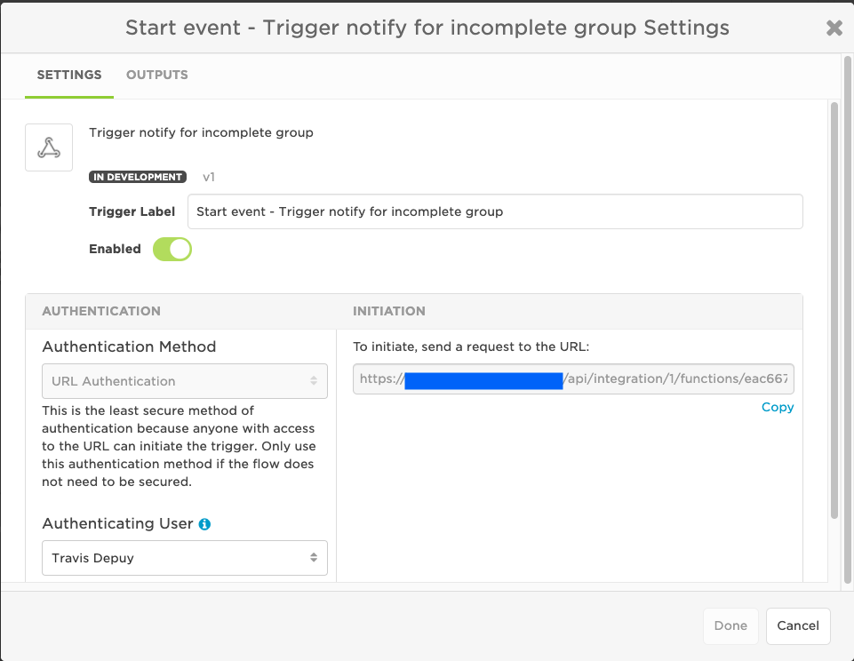
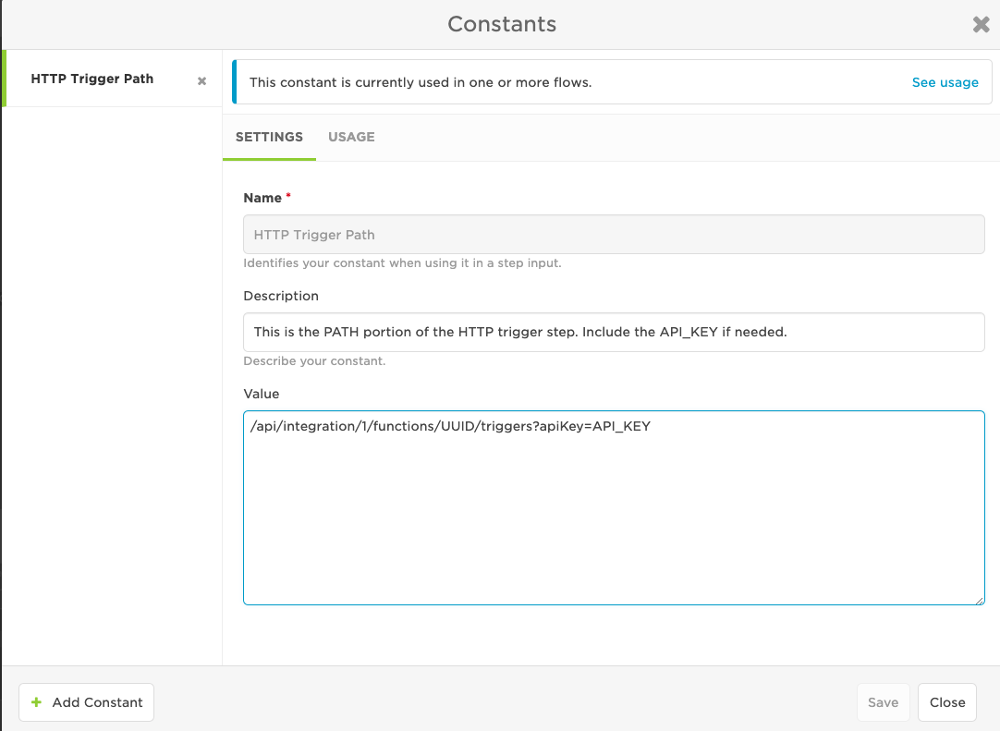
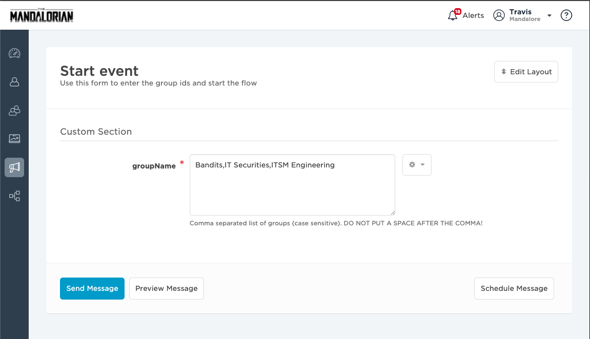
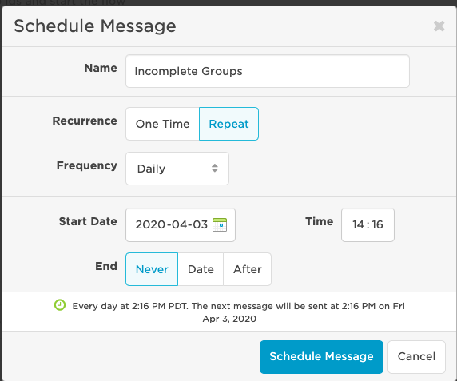

# Compound Integration to Detect Shift Gaps and Empty Shifts
This is a compound integration to solve that problem of whether any of my groups have gaps in the shifts or shifts with no members. Whilst you can do this through the web interface it relies on you going in and looking. With this new integration you can have a scheduled task kick this off every day to report on a list of groups you provide and it will message you with any gaps and empty shifts.

It's not got all the bells and whistles, it doesn't have nice message formatting etc, but should give you a great head start. It only looks for shifts that aren't consecutive so will also fire if your shifts overlap. It also needs tweaking to send you and all clear message if there are no issues. They are all easy for you to fix, I wanted you to have some of the fun!

Regarding scaling, this isn't going to work for big numbers of groups as the flow designer script will timeout. How big you can go, who knows. Give it a try and see.

---------

<kbd>

</kbd>

---------

# How it works

An event is manually generated in the xMatters user interface with a list of group names to check. This event should be scheduled based on the periodicity the check should be performed. Once the event is created, the event status trigger kicks off and passes the group list to a step. This step iterates through the list and for each group calls the HTTP trigger to continue the process. 
The HTTP trigger receives the group name and then makes a series of queries to determine if the shift schedule contains gaps. If so, the group's supervisors are identified and an event is triggered letting them know they need to get coverage for their group. 

# Pre-Requisites

* An xMatters account.
* Developer access.

# Files

* [IncompleteGroups.zip](IncompleteGroups.zip) - The workflow (that has all the scripts and such).

# Installation

## The set up (xMatters)

1. Import the [IncompleteGroups.zip](IncompleteGroups.zip) workflow. 
2. Navigate to Flows > Start event canvas. 
3. Double click the **Check Group** HTTP trigger and copy the url:

<kbd>
	
</kbd>

4. Paste the url into a text editor and extract the "path" portion of the url by removing the entire first part of the url up to the .com. It should be something like `/api/integration/1/functions/UUID/triggers?apiKey=API_KEY`. 
5. Open the Constants and paste this path value into the Value of the `HTTP Trigger Path` constant:

<kbd>
	
</kbd>

6. Save the canvas. 
7. Click Messaging from the left navigator menu and click Start event. Enter the comma separated list of groups to check. Remember not to include a space after the comma. 

<kbd>
	
</kbd>

8. If you want to only fire this once for testing, click Send Message. If you're satisfied, click the Schedule Message button and enter the time and day the message should fire. (Ignore the "No Recipients Selected" warning. The group supervisors will be determined at runtime.)

<kbd>
	
</kbd>

# Testing

To send a quick one time test, click Messaging from the left navigator menu and click Start event. Enter the comma separated list of groups to check. Remember not to include a space after the comma. 

<kbd>
	
</kbd>

Then click Send Message. This will just fire the event once and then stop. 

# Troubleshooting

Investigate the activity stream in the canvas for any errors. 

